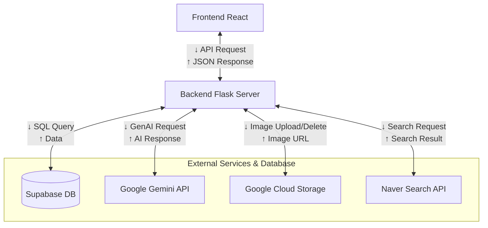
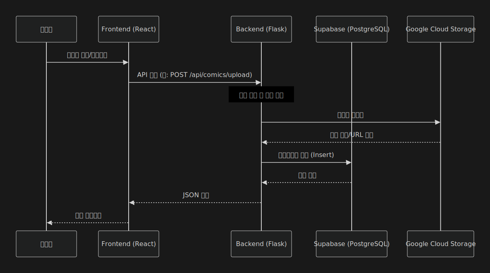

# ComicLib (코믹 라이브러리)

ComicLib은 사용자가 읽은 만화책을 기록하고, 간단한 소감과 등장인물 인기 순위를 매겨 저장하고 공유할 수 있는 나만의 만화 기록 일지 서비스입니다.

## 📁 프로젝트 구조

이 프로젝트는 두 개의 주요 컴포넌트로 구성되어 있습니다:

- **Frontend (`comiclib-app`)**: React 기반의 사용자 인터페이스
- **Backend (`comiclib-api`)**: Python Flask 기반의 API 서버 (AI 기능 및 검색 지원)

---

## 🏗 시스템 아키텍처 및 데이터 흐름

### 🏛 시스템 아키텍처 (System Architecture)

전체 시스템은 클라이언트-서버 구조로 설계되었으며, React 프론트엔드와 Flask 백엔드, Supabase 데이터베이스, 그리고 Google Cloud Platform(GCS, Gemini)으로 구성되어 있습니다.




### 🔄 요청 흐름 (Request Flow)

사용자의 요청(Request)이 클라이언트에서 데이터베이스까지 도달하는 흐름은 다음과 같습니다.

1.  **Client (Frontend)**: 사용자가 브라우저에서 상호작용(예: 만화 목록 조회)을 하면, React 앱이 Flask API 서버로 HTTP 요청을 보냅니다.
2.  **Server (Backend)**: Flask 서버는 요청을 수신하고 필요한 비즈니스 로직을 수행합니다.
3.  **Database / AI / Storage**:
    -   데이터 저장이 필요한 경우 **Supabase** 데이터베이스에 쿼리를 실행합니다.
    -   이미지 업로드/삭제가 필요한 경우 **Google Cloud Storage (GCS)**를 사용합니다.
    -   AI 합성 및 검색이 필요한 경우 **Google Gemini API**를 호출합니다.
4.  **Response**: 처리된 결과를 JSON 형식으로 클라이언트에게 반환합니다.
5.  **Render**: 클라이언트는 받은 데이터를 바탕으로 UI를 업데이트합니다.



### 🗄️ 데이터베이스 스키마 (ERD)

Supabase(PostgreSQL) 데이터베이스의 테이블 구조 및 관계도입니다.


---

## 🚀 Frontend (`comiclib-app`)

사용자 인터페이스를 담당하는 웹 애플리케이션입니다.

### 🛠 사용 언어 및 라이브러리
- **JavaScript (React)**: 사용자 인터페이스 구축을 위한 메인 라이브러리입니다. 컴포넌트 기반 아키텍처를 사용하여 재사용성을 높였습니다.
- **Vite**: 빠른 개발 서버 구동과 최적화된 빌드를 위한 프론트엔드 빌드 툴입니다.
- **Material-UI (@mui/material)**: 구글의 Material Design을 구현한 리액트 컴포넌트 라이브러리입니다.
- **Axios**: 백엔드 API와의 통신을 위해 사용됩니다.
- **React Router**: 페이지 라우팅을 담당합니다.


### 🏃‍♂️ 실행 방법
터미널에서 `comiclib-app` 폴더로 이동 후 다음 명령어를 실행하세요.

```bash
# 폴더 이동
cd comiclib-app

# 의존성 설치
npm install

# 개발 서버 실행
npm run dev
```

서버가 실행되면 브라우저에서 `http://localhost:5173` (기본값)으로 접속할 수 있습니다.

---

## 🐍 Backend (`comiclib-api`)

AI 이미지 합성 및 검색 데이터 처리를 담당하는 백엔드 서버입니다.

### 🛠 사용 언어 및 라이브러리
- **Python**: 데이터 처리와 AI 모델 연동에 강점이 있는 주 언어입니다.
- **Flask**: 가볍고 유연한 마이크로 웹 프레임워크로, RESTful API 서버를 구축했습니다.
- **Supabase**: 오픈소스 Backend-as-a-Service로, PostgreSQL 기반의 관계형 데이터베이스를 제공하며 데이터의 저장 및 조회 기능을 담당합니다.
- **Google GenAI (Gemini)**: 이미지 합성 및 자연어 처리(검색, 챗봇) 기능을 위해 Google의 생성형 AI 모델인 Gemini를 활용합니다.
- **Google Cloud Storage (GCS)**: 이미지 파일(캐릭터 사진, 합성 결과 등)의 안전한 저장을 위해 사용됩니다.
- **Google Search Tool**: 최신 만화 정보를 검색하기 위해 활용됩니다.
- **Google Generative AI SDK**: 클라이언트 측에서 AI 모델과 직접 통신해야 할 경우를 위해 통합되었습니다.

### 🏃‍♂️ 실행 방법 (로컬)
터미널에서 `comiclib-api` 폴더로 이동 후 가상환경을 설정하고 서버를 실행하세요.

```bash
# 폴더 이동
cd comiclib-api

# (선택) 가상환경 생성 및 활성화
python -m venv venv
# Mac/Linux:
source venv/bin/activate
# Windows:
# venv\Scripts\activate

# 의존성 설치
pip install -r requirements.txt

# 서버 실행 (포트 5500)
python app.py
```

> **Note**: 실행 전 `.env` 파일에 필요한 API 키(Gemini API Key 등)가 설정되어 있어야 합니다.

---

## 🐳 Docker 실행 방법

Docker를 사용하여 애플리케이션을 손쉽게 실행할 수 있습니다.

### 1. 한꺼번에 실행하기 (Docker Compose) - **권장**

`docker-compose`를 사용하면 Frontend와 Backend를 동시에 실행하고 자동으로 연결할 수 있습니다.

```bash
# 프로젝트 루트 경로에서 실행
docker-compose up --build
```

- **Frontend**: `http://localhost:8080`
- **Backend**: `http://localhost:5000`

### 2. 개별적으로 실행하기

#### Backend (`comiclib-api`)

```bash
cd comiclib-api
docker build -t comiclib-api .
docker run -d -p 5000:5000 --env-file .env --name comiclib-api comiclib-api
```

#### Frontend (`comiclib-app`)

Frontend는 API 서버와 통신해야 하므로, 동일한 네트워크에 있거나 호스트 네트워킹을 사용해야 할 수 있습니다.

```bash
cd comiclib-app
docker build -t comiclib-app .
docker run -d -p 8080:80 --name comiclib-app comiclib-app
```

> **Note**: 개별 실행 시에는 Frontend가 Backend를 찾지 못할 수 있으므로 **Docker Compose 사용을 권장**합니다.

---

## ✨ 주요 기능

1.  **만화책 등록 (Register)**:
    -   Google Search Tool을 활용한 만화 정보 자동 검색
    -   읽은 만화책 기록 및 표지 저장
2.  **상세 페이지 (Detail & Management)**:
    -   캐릭터 관리: 사진 업로드, 메모 작성, 호감도 설정
    -   **사진 관리**: 캐릭터별 사진 갤러리 및 삭제 기능 (GCS 연동)
    -   다국어 지원: 한국어/영어 전환
3.  **베프와 4컷 (AI 4-Cut)**:
    -   내 사진과 캐릭터 사진을 합성하여 네컷 만화 스타일 이미지 생성
    -   생성된 이미지 저장 및 갤러리 공유
4.  **통계 (Stats)**:
    -   내가 등록한 캐릭터 수 및 활동 통계 확인


---

## 📖 사용 가이드 (User Guide)

### 🏠 Friend House
*   **Add Friend**를 탭하고 제목으로 검색하세요
*   목록에서 결과를 선택하세요
*   좋아하는 캐릭터를 선택하세요
*   자동으로 채워진 정보를 확인하고 취향에 맞게 수정하세요
*   **Add Friend House**를 탭하여 완료하세요 ✨

### 📊 Stats
*   **Stats** 메뉴에서
    *   **My Friends / My Friend Houses**를 한눈에 확인하세요
*   연필 아이콘을 사용하여 세부 정보를 수정하세요
*   URL 또는 직접 업로드를 통해 사진을 추가하세요
*   **News List**를 체크하면 메인 화면에서 최신 소식을 볼 수 있습니다
*   **Character Photos**에서 AI가 생성한 이미지를 확인하세요
*   Friend House에서:
    *   **+ / -** 를 사용하여 친구를 추가하거나 제거하세요
    *   **Edit**으로 업데이트하고, **Cancel**로 취소하세요 👌

### 📸 Bestie 4-Cut
*   **My Photo + Friend Photo**를 업로드하세요
*   행동(Action)과 분위기(Mood) 키워드를 입력하세요
*   합성할 캐릭터를 선택하세요
*   **Generate AI Image**를 탭하세요 (시간이 조금 걸릴 수 있습니다 ⏳)
*   마음에 드나요? 저장하고 **Character Photos**에서 확인하세요 📸

### 📰 2D Friend News
*   **News List**에 추가된 친구들을 기반으로 합니다
*   최근 2개월간의 이벤트를 찾습니다
*   로딩에 시간이 조금 걸릴 수 있습니다
*   **Read more**를 탭하여 원본 페이지를 여세요 🔗

### 🌐 Language
*   **KO** → 한국어
*   **EN** → 영어
*   탭 한 번으로 즉시 전환됩니다 👍


