# ComicLib

ComicLib is a personal comic log service that allows users to record comics they have read, save brief reviews, rank characters, and share their logs.

## 📁 Project Structure

This project consists of two main components:

- **Frontend (`comiclib-app`)**: User interface based on React
- **Backend (`comiclib-api`)**: API server based on Python Flask (supports AI features and search)

---

## 🏗 System Architecture and Data Flow

### 🏛 System Architecture

The entire system is designed with a client-server structure, consisting of a React frontend, Flask backend, Supabase database, and Google Cloud Platform (GCS, Gemini).




### 🔄 Request Flow

The flow of a user's request from the client to the database is as follows:

1.  **Client (Frontend)**: When a user interacts in the browser (e.g., viewing a comic list), the React app sends an HTTP request to the Flask API server.
2.  **Server (Backend)**: The Flask server receives the request and executes the necessary business logic.
3.  **Database / AI / Storage**:
    -   Executes queries to **Supabase** database if data storage is needed.
    -   Uses **Google Cloud Storage (GCS)** if image upload/delete is needed.
    -   Calls **Google Gemini API** if AI synthesis or search is needed.
4.  **Response**: Returns the processed result to the client in JSON format.
5.  **Render**: The client updates the UI based on the received data.


### 🗄️ Database Schema (ERD)

This is the table structure and relationship diagram of the Supabase (PostgreSQL) database.


---

## 🚀 Frontend (`comiclib-app`)

This is the web application responsible for the user interface.

### 🛠 Languages and Libraries
- **JavaScript (React)**: Main library for building the user interface. Component-based architecture is used to increase reusability.
- **Vite**: Frontend build tool for fast development server and optimized builds.
- **Material-UI (@mui/material)**: React component library implementing Google's Material Design.
- **Axios**: Used for communication with backend APIs.
- **React Router**: Handles page routing.


### 🏃‍♂️ How to Run
Navigate to the `comiclib-app` folder in the terminal and run the following commands:

```bash
# Move to folder
cd comiclib-app

# Install dependencies
npm install

# Run development server
npm run dev
```

Once the server is running, you can access it at `http://localhost:5173` (default) in your browser.

---

## 🐍 Backend (`comiclib-api`)

This is the backend server responsible for AI image synthesis and search data processing.

### 🛠 Languages and Libraries
- **Python**: Main language with strengths in data processing and AI model integration.
- **Flask**: Lightweight and flexible micro web framework used to build the RESTful API server.
- **Supabase**: Open-source Backend-as-a-Service providing a PostgreSQL-based relational database for data storage and retrieval.
- **Google GenAI (Gemini)**: Google's generative AI model, Gemini, is used for image synthesis and natural language processing (search, chatbot).
- **Google Cloud Storage (GCS)**: Used for secure storage of image files (character photos, synthesis results, etc.).
- **Google Search Tool**: Utilized to search for the latest comic information.
- **Google Generative AI SDK**: Integrated for cases where direct communication with the AI model is needed from the client side.

### 🏃‍♂️ How to Run (Local)
Navigate to the `comiclib-api` folder in the terminal, set up a virtual environment, and run the server.

```bash
# Move to folder
cd comiclib-api

# (Optional) Create and activate virtual environment
python -m venv venv
# Mac/Linux:
source venv/bin/activate
# Windows:
# venv\Scripts\activate

# Install dependencies
pip install -r requirements.txt

# Run server (Port 5500)
python app.py
```

> **Note**: Before running, necessary API keys (Gemini API Key, etc.) must be set in the `.env` file.

---

## 🐳 How to Run with Docker

You can easily run the application using Docker.

### 1. Run All at Once (Docker Compose) - **Recommended**

Using `docker-compose` allows you to run both Frontend and Backend simultaneously and connect them automatically.

```bash
# Run from project root
docker-compose up --build
```

- **Frontend**: `http://localhost:8080`
- **Backend**: `http://localhost:5000`

### 2. Run Individually

#### Backend (`comiclib-api`)

```bash
cd comiclib-api
docker build -t comiclib-api .
docker run -d -p 5000:5000 --env-file .env --name comiclib-api comiclib-api
```

#### Frontend (`comiclib-app`)

Since the Frontend needs to communicate with the API server, they may need to be on the same network or use host networking.

```bash
cd comiclib-app
docker build -t comiclib-app .
docker run -d -p 8080:80 --name comiclib-app comiclib-app
```

> **Note**: When running individually, the Frontend might not find the Backend, so **using Docker Compose is recommended**.

---

## ✨ Key Features

1.  **Register Comic**:
    -   Automatic comic information search using Google Search Tool
    -   Record read comics and save covers
2.  **Detail & Management**:
    -   Character management: Upload photos, write notes, set affinity
    -   **Photo Management**: Character photo gallery and delete function (GCS integrated)
    -   Multilingual support: Switch between Korean/English
3.  **Bestie 4-Cut (AI 4-Cut)**:
    -   Generate 4-cut comic style images by synthesizing user photo and character photo
    -   Save generated images and share in gallery
4.  **Stats**:
    -   Check the number of registered characters and activity statistics

---

## 📖 User Guide

### 🏠 Friend House
*   Tap **Add Friend** and search by title
*   Select a result from the list
*   Choose a character you like
*   Check the auto-filled info and customize it to your taste
*   Tap **Add Friend House** to finish ✨

### 📊 Stats
*   In the **Stats** menu:
    *   View **My Friends / My Friend Houses** at a glance
*   Use the pencil icon to edit details
*   Add photos via URL or direct upload
*   Check **News List** to see the latest updates on the main screen
*   Check AI-generated images in **Character Photos**
*   In Friend House:
    *   Use **+ / -** to add or remove friends
    *   Update with **Edit**, or discard with **Cancel** 👌

### 📸 Bestie 4-Cut
*   Upload **My Photo + Friend Photo**
*   Enter Action and Mood keywords
*   Select a character to combine
*   Tap **Generate AI Image** (this may take a moment ⏳)
*   Like it? Save it and check it in **Character Photos** 📸

### 📰 2D Friend News
*   Based on friends added to **News List**
*   Finds events from the past 2 months
*   Loading may take a little time
*   Tap **Read more** to open the original page 🔗

### 🌐 Language
*   **KO** → Korean
*   **EN** → English
*   Switch instantly with one tap 👍
